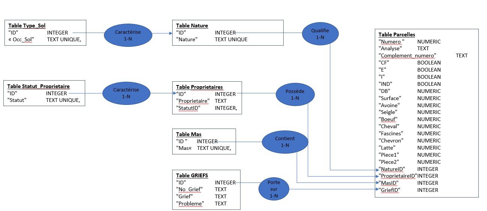

# Travaux préliminaires pour l’utilisation du fichier des données de la Mappe Sarde de Beaufort (73)

## Introduction

Notice : Inventaire des atlas du cadastre sarde (in <https://francearchives.gouv.fr> : Accueil / Archives de la Haute-Savoie / Inventaire - 2253 W 1-486

_« Ces atlas ont été réalisés par Dominique Barbero à partir du dépouillement des plans cadastraux sardes du XVIIIe siècle (couramment appelés mappes) et des documents écrits correspondants (registres de tabelles, livres de géométrie, livres des numéros suivis, livres d'estime, livres de calculation, registres de tabelle préparatoire, cahiers des cottets à griefs) conservés aux Archives départementales de la Haute-Savoie dans la sous-série 1 C._

_Les atlas livrés depuis 2008 ont été commandés à un prestataire (FCA-SIG) par les Archives départementales de la Haute-Savoie dans le cadre d'un marché public financé par le Conseil général de la Haute-Savoie. Ceux de la période antérieure avaient été financés par l'Assemblée des pays de Savoie (APS). »_

J’ai acheté directement à Dominique BARBERO le CD-ROM correspondant à la commune de Beaufort. Ce CD-Rom contient en particulier un fichier « Beaufort-FICHIER-ATLAS-OK.xls »

Remarque : le CD-ROM reçu concerne une commune de Savoie et le travail fait à l’époque (a priori avant 2008) ne contient pas de données géographiques et les contours des parcelles (associées à leur numéro) sont de simple fichier jpg (donc des cartes raster et non vectorielles). La géolocalisation des parcelles semble avoir été menée par la Haute-Savoie seulement et après 2008.

L’objet de cette présente phase de travail consiste à transformer le document Excel en une base de données afin de faciliter les analyses ultérieures et permettre des analyses avec un Système d’Information Geographique (SIG).

## 1 - Analyse des Données reçues

J’ai comme point de départ le fichier Excel « Beaufort-FICHIER-ATLAS-OK.xls » contenant 17803 lignes + une ligne d’en-têtes des colonnes :

- Numéro : il s’agit des numéros de parcelles a priori numériques dont le plus grand numéro est 17691. Il devrait a priori avoir 17691 parcelles sur la commune de Beaufort du Cadastre Sarde mais on constate immédiatement que le nombre de lignes ne correspond pas au nombre de parcelles
- CF : Chef-lieu « O » ou « null » ; signification à investiguer ultérieurement
- E : Ancien fond ecclésiastique « O » ou « null » ; signification à investiguer ultérieurement
- I : « O » ou « null » ; signification à investiguer ultérieurement (dans la notice livrée avec le CD-Rom il est fait mention à cet emplacement d’une colonne nommée « N » (pour Noble)
- Propriétaires : nous avons là des noms et prénoms des propriétaires avec parfois des compléments d’information par exemple « MONOD Jeanne soit Popelin veuve d'Antoine GACHET » ou « TARIN Nicolas et Humbert son frère» et aussi des noms de communautés par exemple « La communauté pour l'usage commun » ou « Chapelle de Roselend »
- Statut : cette colonne contient du texte avec des valeurs répété : « Bourgeois » «  communier » … il s’agit d’une information sur le statut du propriétaire a priori tel qu’il est inscrit sur le registre associé au cadastre
- IND : parcelle en indivision, elle contient des valeurs « null » et quelque « O »
- Mas : cette colonne contient du texte avec des valeurs répétées : « Roselend » « Lay » … ce sont des noms de lieux, le mot « Mas » correspond souvent à un hameau ou à un lieu-dit de la commune ou plutôt toute la zone territoriale d’influence de ce hameau
- Nature : cette colonne contient du texte avec des valeurs répété : « Roc » « Pâturage » ; « Marais et pâturage » … qui sont des descriptions de la nature du sol
- DB : cette colonne contient des valeurs numériques 0, 1 , 2 ou 3 qui correspond aux quatre « degrés de bonté » de la parcelle. Le degré de bonté est une évaluation de la qualité (ou le rendement) du sol, faite par les agents du duché de Savoie en charge du relevé du cadastre, il a un but fiscal
- m² : il s’agit sans doute de la surface de la parcelle en m² ; le registre du cadastre contenant de valeur de superficie selon une double mesure : la mesure de Savoie (Journaux, toises, pieds) et mesure de Piémont (Journaux, Tables, Pieds). Cette conversion a été réalisée sans doute par le créateur du fichier D.BARBERO.
- Avoine : des valeurs null ou numérique s’étalant de 13,5 à 22
- Seigle : des valeurs null ou numérique s’étalant de 0,5 à 4 (les valeurs 0,5 sont stockées au format texte « 1 / 2 » que j’ai transformé en 0,5
- F. Bœuf : sous bœuf sont regroupés le nombre de bovins la colonne contient des valeurs numériques de 0,5 à 9 puis pour les valeurs supérieures le nombre est suivi de la lettre « L » : « 10 L », « 12 L », « 100 L » …
- F. Cheval : sous Cheval sont regroupés le nombre d’équidés de toute sorte (âne, mule, mulet cheval ) . La colonne contient des valeurs numériques de 0,5 à 9 puis pour les valeurs supérieures le nombre est suivi de la lettre « L » : « 10 L », « 12 L », « 100 L » …
- Fascines : (fagot de petit bois ?) valeur numérique non investiguée pour l’instant
- Chevron : valeur numérique non investiguée pour l’instant
- Latte : valeur numérique non investiguée pour l’instant
- Pièce 1 : valeur numérique non investiguée pour l’instant
- Pièce 2 : valeur numérique non investiguée pour l’instant
- N° Grief : champs pouvant contenir une ou plusieurs valeurs numériques, il s’agit de numéro de référence des contestations faites auprès des autorités relativement à la parcelle cadastrée. En principe il faudrait normaliser ce champ et créer une logique de relation 1-n entre une parcelle et les griefs associés, cependant il n’y a que 22 cas où une parcelle est associée à 2 ou 3 griefs, et l’étude des griefs est très secondaire dans notre étude.
- Grief : champ texte contenant une typologie selon les types de griefs
- Problèmes : descriptif sommaire du grief

**Degré de Bonté :**

*« Dans l’attribution des degrés de bonté, chaque type d’occupation du sol comporte les trois classes ; la qualité de la parcelle pouvant être bonne (1), moyenne (2) ou mauvaise (3). Par exemple pour la paroisse de Landry en vallée de Tarentaise (Savoie) la « note des estimes en degré avec leurs catégories[13](https://journals.openedition.org/geocarrefour/7650#ftn13)… » nous informe sur la production qu’un terrain doit fournir pour se voir attribuer tel ou tel degré de bonté. Un pâturage doit produire annuellement deux quintaux de foin pour obtenir le degré de bonté 1, un quintal et demi pour le 2 et un quintal pour le 3. Pour les champs, la mesure est en bichet[14](https://journals.openedition.org/geocarrefour/7650#ftn14) et il en faut vingt-neuf répartis en froment, seigle et farine pour répondre aux critères du degré de bonté 1, vingt-six pour le 2 et vingt-trois pour le 3, et ainsi de suite pour chaque usage du sol. Pour le bâti, les estimateurs attribuent le degré de bonté d’une terre voisine, de préférence appartenant au même propriétaire. Cette méthode d’évaluation des terrains fixe des niveaux d’exigence précis basés sur le rendement de la parcelle. Ainsi, les parcelles classées en 1 sont de bonnes terres productives, car les critères exigés pour avoir ce degré de bonté sont du même niveau. Le fait que chaque nature de sol comporte l’intégralité des classes (1, 2 et 3) et que les critères d’évaluation répondent à un même niveau d’exigence permet une comparaison entre deux terrains du même degré de bonté. »*

**Dominique Baud**, «  Dynamiques paysagères d’un finage savoyard : l’apport des archives cadastrales (début XVIIIe\-fin XIXe s.) », Géocarrefour Vol. 85/1 | 2010, mis en ligne le 27 mai 2010,. URL : <http://journals.openedition.org/geocarrefour/7650>  

**Mesure de Savoie :**

*« La base de ce système est le « pied de chambre de 0,033m qui élevé au carré donne le « pied de cadastre de 0.92m². un carré de 8 pieds forme la toise carrée (7.370m²) et 400 toises carrées équivalent à un journal de Savoie dont la valeur exacte est de 29.4838 ares. On compte pour les approximations 3 journaux à l’hectare »*
Paul GUICHONNET, Le cadastre savoyard de 1738 et son utilisation pour les recherches d'histoire et de géographie sociales \[article Revue de Géographie Alpine Année 1955\] P272 (<https://www.persee.fr/doc/rga_0035-1121_1955_num_43_2_1175> )

**Mesure de Piemont :**

*« Les cadastreurs piémontais se servirent des unités de leur pays et qui dérivaient du _pied liprand_ de 0,513 m. Il fallait 6 pieds pour faire un _trabuc_ (3,082 m) et 2 trabucs pour une perche (6,164 m). Ces mesures linéaires servaient de base aux unités agraires suivantes : le pied de table (rectangle de 1 x12 pieds liprands de côté) ou 3,167 m². La _table_, ou perche carrée vaut 12 pieds de table (38,009 m) et 100 tables, ou 400 trabucs carrés, donnent un _journal de Piémont_. La mesure de Piémont est à préférer lorsqu’on utilise l’ancien cadastre. Pour les usagers soucieux de l’exactitude des contenances, elle est évidemment meilleure car elle résulte des opérations sur le terrain ; pour l’historien, elle est commode car la conversion des tables en journaux repose sur la base 100. »*
Idem

**Mas :**

*«On a la preuve, par les reconnais; féodales, que les mas sont antérieurs de trois ou quatre siècles au cadastre, et que les « trabucants » piémontais n’ont fait qu’enregistrer un état de fait profondément et obscurément enraciné dans la tradition paysanne. Les mas appartiennent à plusieurs propriétaires, nobles ou roturiers, et le régime foncier de 1730 recouvre une réalité agraire très antérieure; ils chevauchent parfois plusieurs communes et ne portent pas toujours le nom des villages ou des lieux-dits qu’ils renferment, mais un toponyme d’étymologie romaine ou germanique. Leur étendue comprend rarement une seule zone de végétation, mais englobe différents types de terroirs et semble bien représenter une unité élémentaire d'exploitation, domaine d’un seul individu. »*
Idem p296

## 2 - Redressements des données

### 2.1 - Nettoyage

- Pb colonne « Numero »

En fin de fichier il y a 13 lignes avec des valeurs alphanumériques : 12 parcelles ont une lettre à la suite du numéro de parcelle et 1 parcelle a une lettre sans numéro :

17160 B;;;;BOUCHAGE Jean Baptiste;Communier;;Charnes;Jardin;2;48;20 1/2;2 1/2;;;;;;;;;;
17161 A;;;;BUGAND Claude;Communier;;Charnes;Champ;1;67;15 1/2;1 1/2;;;;;;;;;;
17301 A;;;;MARTIN Claude;Communier;;Charnes;Pré;3;1128;;;3 ;;;;;;;;;
17302 B;;;;MARTIN Claude;Communier;;Charnes;Broussailles;3;507;;;;;60;;;;;;;
17303 C;;;;La communauté pour l'usage commun;Communaux;O;Charnes;Roc sapins;2;46421;;;;;;;2;;;;;
17304 D;;;;La communauté pour l'usage commun;Communaux;O;Charnes;Pâturage;3;49471;;;2 ;;;;;;;;;
17305 E;;;;La communauté pour l'usage commun;Communaux;O;Charnes;Roc et broussailles;2;27146;;;;;4;;;;;;;
17306 F;;;;La communauté pour l'usage commun;Communaux;O;Charnes;Roc;3;29106;;;;;;;;;;;;
17307 G;;;;La communauté pour l'usage commun;Communaux;O;Charnes;Bois sapins;3;83831;;;;;;3;4;;;;;
17308 H;;;;La communauté pour l'usage commun;Communaux;O;Charnes;Roc;3;376689;;;;;;;;;;;;
17309 I;;;;La communauté pour l'usage commun;Communaux;O;Charnes;Roc et pâturage;3;80813;;;10 L;;;;;;;;;
17310 K;;;;La communauté pour l'usage commun;Communaux;O;Bodin;Champ;3;144890;14 1/2; 1/2;;;;;;;;;;
A;;;;TOCCAT Daniel;Communier;;;;3;1543;;;;;;;;;;;;

J’ai créé une nouvelle colonne «Complement_numéro ».

Les lettres des 13 lignes sont déplacées dans cette nouvelle colonne

Et la ligne sans numéro se voit attribuer un numéro « 0 »

Il y a aussi des parcelles dont le numéro est suivi de 1/2 , 1/3 ou 1/4 , ces valeurs ont été remplacées par des décimales ajoutées au numéro de parcelle.

Il reste à comprendre pourquoi le nombre de lignes est significativement différent de la valeur maximum de numéro de parcelle. Mais nous allons d’abord importer ce fichier dans une base de données de travail.

- Pb colonnes « CF » , « E », « I » , « IND »

Les valeurs « O » dans les colonnes « CF » , « E », « I » , « IND » ont été remplacées par des « Oui » afin de permettre une caractérisation booléenne.

- Pb colonne « m² »

147 ;;;;VIALLET Jacques fils de Benoit;Communier;;Praz;Chenevier;1;#VALUE!;21;3;;;;;;;;;;

Le valeur #value est remplacé par la valeur « null

- Pb colonne « Nature »

La colonne Nature est longue et contient beaucoup de double description, par exemple « bois et pâturage » ou « prés et teppes », une option de normalisation aurait été de décomposer en une relation 1-N : une parcelle pouvant être reliée alors à deux natures « bois et «  paturage » ; mais n’étant pas certain de comprendre précisément l’intention du géomètre-cadastreur, j’ai pris l’option de laisser pour l’instant le champ nature tel quel Mais en revanche de créer un concept « Occupation_Sol » pour regrouper les nombreuses « Natures » en ensemble homogène en prenant pour principe lorsqu’une Nature est « multiple » de prendre la première comme la Nature principale ; par exemple « « bois et paturage » » aura la valeur « Bois » pour « Occupation_Sol »

- Pb colonne « Mas »

Pour les Mas il y a des mas dont les libellés se ressemblent, par exemple : « coutafalliat » et » coutassalliat  » (les » s » et les «f » dans la graphie du XVIIIe), mais comme les numéros de parcelles ne sont pas continus entre les deux orthographes, j’ai décidé de laisser les libellés de mas tel quel en attendant un travail futur de représentation cartographique des mas et parcelles.

- Pb colonnes « Avoine », «Seigle », « Boeuf », « Cheval », « Fascines  » , « Chevron » , « Latte» :

Les champs « Avoine », «Seigle », « Boeuf », « Cheval », « Fascines  » , « Chevron » , « Latte» décrivent soit une quantité de production d’Avoine de seigle, de fagots de bois (Fascines ?) et c’est logique qu’elle soit associée à une certaine parcelle précise, mais pour les autres il s’agit d’un nombre de bêtes ; cette dernière valeur pose question, car cela devrait:

- Être associé au propriétaire et correspondre à la taille de son troupeau (cela poserait alors d’autres questions, car pour la gestion des alpages (en été) les troupeaux sont constitués de bêtes appartenant en propre et des bêtes en location) ; cela ne semble pas être le cas, car pour un propriétaire possédant plusieurs parcelles le nombre de bêtes varie selon une logique non claire ; exemple :

| Parcelles | Propriétaires | Mas | Nature | DB  | Surface | Boeuf |
| --- | --- | --- | --- | --- | --- | --- |
| 7806 | BLANC Jean Baptiste | Val de Treicol | Grange | 2   | 67  | 180 |
| 7807 | BLANC Jean Baptiste | Val de Treicol | Grange | 2   | 181 | 180 |
| 7808 | BLANC Jean Baptiste | Val de Treicol | Pâturage | 2   | 31130 | 180 |
| 7774 | BLANC Jean Baptiste | Val de Treicol | Grange | 2   | 206 | 160 |
| 7776 | BLANC Jean Baptiste | Val de Treicol | Pâturage et rocher | 2   | 86210 | 160 |
| 8331 | BLANC Jean Baptiste | Couecle | Pâturage et broussailles | 2   | 65791 | 150 |
| 8323 | BLANC Jean Baptiste | Couecle | Pâturage | 2   | 147294 | 120 |
| 8324 | BLANC Jean Baptiste | Couecle | Grange | 2   | 79  | 120 |
| 7802 | BLANC Jean Baptiste | Val de Treicol | Pâturage | 3   | 10135 | 50  |
| 7803 | BLANC Jean Baptiste | Val de Treicol | Pâturage | 3   | 22085 | 30  |

- Ou être associé à une ou plusieurs parcelles : il est évident qu’un troupeau qui « remue » change de parcelle régulièrement.

J’ai donc conservé ces champs tels quels comme attribut de la parcelle en attendant de comprendre comment cette donnée fonctionne (il faudra sans aucun doute revenir au registre original manuscrit associé au Cadastre Sarde conservé aux Archives Départementales de Savoie)

- Pb colonnes « Avoine » et « Seigle »

Par exemple dans la ligne :

5299 ;;;;DUITTOZ GENIS;Communier;;Bersend;Champ;3;377;14 1/2; 1/2;;;;;;;;;;

Il est inscrit 14 1/2 pour 14,5 et 1/2 pour 0.5

En ouvrant le fichier avec Excel, les valeurs sont bien comprises par le logiciel comme des nombres décimaux, sauf lorsque la valeur est 1/2 qui reste comprise comme du texte

Les 668 cas des colonnes « Avoine » et « Seigle » ont été corrigés

- Pb colonnes Bœuf et Cheval

Il existe des « L » qui suivent les valeurs supérieures à 10 ; je ne sais pas à quoi cela correspond (sans doute pas l’unité de mesure Livre. Ces « L » sont supprimés afin d’avoir des colonnes numériques. (Il faudra tout de même vérifier ce qui est inscrit dans le registre.

Il y a aussi un cas où la cellule Bœuf contient une virgule ; elle est remplacée par « Null»

Pour la colonne Cheval il y a aussi 4 cas de « 1/2» remplacés par «  0.5»

- Pb colonnes No Grief, Grief, Problème

Il existe des lignes dont le champ « Problèmes» n’a pas de numéro de Grief associé sans numéro., j’ai ajouté une numérotation allant de 800 à 952 et la description « Grief sans numéro »

- divers

J’ai aussi modifié certains titres de colonnes (remplacement des é , ², œ, espace…)

Et j’ai ajouté une colonne » Analyse » (vide) qui servira pour stocker les résultats de mes analyses des numéros de parcelles.

Désormais nous avons un fichier csv contenant des champs propres et homogènes :

| Analyse | Texte |
| --- | --- |
| Numero | Numerique |
| Complement_numero | Texte |
| CF  | booléen (Oui/Non) |
| E   | booléen (Oui/Non) |
| I   | booléen (Oui/Non) |
| Proprietaires | Texte |
| Statut | Texte |
| IND | booléen (Oui/Non) |
| Mas | Texte |
| Nature | Texte |
| DB  | Numerique |
| Surface | Numerique |
| Avoine | Numerique |
| Seigle | Numerique |
| Bœuf | Numerique |
| Cheval | Numerique |
| Fascines | Numerique |
| Chevron | Numerique |
| Latte | Numerique |
| Pièce1 | Numerique |
| Pièce2 | Numerique |
| No_Grief | Texte |
| Grief | Texte |
| Problemes | Texte |

Vérifications à mener ultérieurement :

- Comprendre les numérotations de parcelles décimales, doublons et manquantes en consultant les registres originaux aux archives départementales de Savoie
- Idem pour les griefs sans numéros (cela ressemble à une erreur de manipulation par l’auteur du fichier Excel source, les mentions sans numéro semblent faire suite d’une mention préalable, comme si un « ;» ou autre avait décalé les données d’un champ unique

## 3 - Modélisation de la BdeDl

**Schéma du Modèle de Données**\
\
**Modèle BdeD-Beaufort**\

Remarque : Je n’ai pas normalisé les Griefs (22 parcelles seulement sont associées à plusieurs n° de Griefs) parce que cela n’est pas le sujet de l’étude pour l’instant (mais il faudra tout de même regarder les griefs, car sur 562 parcelles avec grief il y en a 446 avec «  erreur de propriétaire» .

## 4 - Création de la BdeD et chargement des données

J’ai utilisé :

- SQLite + DB Browser for SQLite
- Python (Spider)
- Et ChaptGpt (pour m’aider à écrire les SQL lorsqu’il me fallait créer en même temps des index de clés étrangères.

### 4.1 - Étape d’initialisation

J’ai d’abord converti le fichier Excel en un fichier csv (encodage utf-8) : Beaufort_FICHIER_ATLAS_OK.csv

J’ai écrit un programme python « 1_initialisation_BdeD.py » qui

1. Crée la base de donne : « BdeD_etape_1 » et s’y connecte
2. Crée les tables Beaufort_FICHIER_ATLAS_OK (le champ Numero est « Numeric » et non Integer, car il contient parfois des nombres décimaux) et Parcelles_Theoriques
3. Charge le fichier Beaufort_FICHIER_ATLAS_OK.csv dans un dataframe (pandas) en excluant les éventuelles lignes vides du csv
4. Insert les données du dataframe dans la table créée
5. Crée une série avec les valeurs e 1 à 17691 dans un autre dataframe
6. Insert les données du deuxième dataframe dans la table Parcelles_Theorique
7. Commit et clôture de la connexion à la base de donnée

### 4.2 - Nettoyage de la base et Analyse

J’ai assemblé dans un programme python « 2 Nettoyage_et_analyse.py » une série de SQL :

- Inscription de « Parcelle_ok » dans la colonne Analyse pour toutes les correspondances entre la table « Beaufort… » et la table parcelle_théoriques
- Ajout de lignes vides avec «Parcelle_non_reférencée » dans la colonne Analyse pour tous les enregistrements de « Parcelles_theoriques » qui n’existent pas dans « Beaufort… »
- Inscription de « Parcelle_decimale » dans la colonne Analyse chaque fois que le numéro de parcelle n’est pas un entier
- Inscription de « Doublon » dans la colonne Analyse pour chaque enregistrement en double (ou triple ou …)
- Distinction entre le premier doublon « Doublon1 » et les autres « Doublon2 »
- Concaténation avec la mention «  Parc_dec » pour les cas où Doublon1 et Doublon2 ont aussi un numéro de parcelle décimal
- Ajout de la mention «  Parcelle non numérotée » pour l’enregistrement dont le numéro est égal à « 0 »
- Modification du numéro de parcelle (en ajoutant 0.01) pour les « Doublon1 »
- Modification du numéro de parcelle (en ajoutant 0.02) pour les « Doublon2»
- Modification des valeurs des colonnes « Mas » et « Nature » en minuscule (afin de permettre les regroupements futurs pour les cas où les valeurs diffèrent seulement par la casse)

### 4.3 - Création des tables et index selon la modélisation définie

Le programme Python « 3 Creation des Tables.py » crée toutes les tables avec les indexes et clés étrangères le cas échéant.

### 4.4 - Chargement des tables avec les données extraites de la table « Beaufort… »

Le programme Python « 4 Chargement des données et Index.py » exécute un certain nombre de SQL pour charger les données dans chaque table.

J’ai créé manuellement un fichier CSV « 4_type_sol.csv » qui associe a chaque valeur distincte de « Nature » de la table « Beaufort… » un attribut appelé « Occ_Sol ». Cela permet de regroupe toutes les descriptions de la nature des parcelles en famille (Bâti, Bois, Pâturage, Prés,…)

## Conclusion

Nous avons maintenant une base de données prête pour l’analyse.